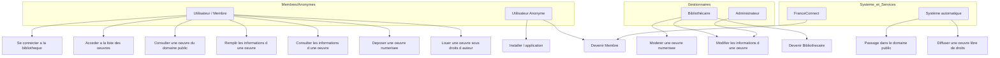

```mermaid
%% Diagramme de cas d'utilisation global - version esthétique

%% Définir un diagramme top-down
graph TD

%% Membres / Utilisateurs
subgraph Membres/Anonymes
    User[Utilisateur / Membre]
    Anonymous[Utilisateur Anonyme]
end

%% Bibliothécaires / Administrateurs
subgraph Gestionnaires
    Librarian[Bibliothécaire]
    Admin[Administrateur]
end

%% Services externes / Système
subgraph Systeme_et_Services
    FC[FranceConnect]
    Systeme[Système automatique]
end

%% Cas d'utilisation Membres
User --> UC1["Se connecter a la bibliotheque"]
User --> UC2["Acceder a la liste des oeuvres"]
User --> UC3["Consulter une oeuvre du domaine public"]
User --> UC4["Remplir les informations d une oeuvre"]
User --> UC5["Consulter les informations d une oeuvre"]
User --> UC6["Deposer une oeuvre numerisee"]
User --> UC7["Louer une oeuvre sous droits d auteur"]

Anonymous --> UC8["Installer l application"]
Anonymous --> UC9["Devenir Membre"]

%% Cas d'utilisation Bibliothécaires / Admin
Librarian --> UC10["Moderer une oeuvre numerisee"]
Librarian --> UC11["Modifier les informations d une oeuvre"]
Librarian --> UC12["Devenir Bibliothecaire"]

Admin --> UC11

%% Cas d'utilisation Services
FC --> UC9
Systeme --> UC13["Passage dans le domaine public"]
Systeme --> UC14["Diffuser une oeuvre libre de droits"]
```