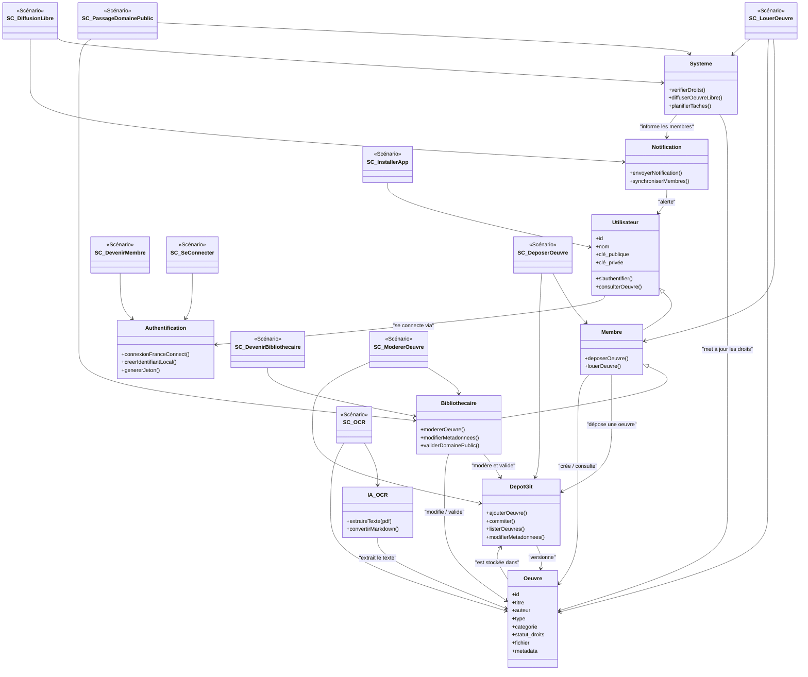

```mermaid
classDiagram
    %% =========================
    %% ACTEURS PRINCIPAUX
    %% =========================
    class Utilisateur {
        +id
        +nom
        +clé_publique
        +clé_privée
        +s'authentifier()
        +consulterOeuvre()
    }

    class Membre {
        +deposerOeuvre()
        +louerOeuvre()
    }

    class Bibliothecaire {
        +modererOeuvre()
        +modifierMetadonnees()
        +validerDomainePublic()
    }

    Utilisateur <|-- Membre
    Membre <|-- Bibliothecaire

    %% =========================
    %% ENTITÉS MÉTIERS
    %% =========================
    class Oeuvre {
        +id
        +titre
        +auteur
        +type
        +categorie
        +statut_droits
        +fichier
        +metadata
    }

    class DepotGit {
        +ajouterOeuvre()
        +commiter()
        +listerOeuvres()
        +modifierMetadonnees()
    }

    class IA_OCR {
        +extraireTexte(pdf)
        +convertirMarkdown()
    }

    class Systeme {
        +verifierDroits()
        +diffuserOeuvreLibre()
        +planifierTaches()
    }

    class Authentification {
        +connexionFranceConnect()
        +creerIdentifiantLocal()
        +genererJeton()
    }

    class Notification {
        +envoyerNotification()
        +synchroniserMembres()
    }

    %% =========================
    %% RELATIONS ENTRE CLASSES
    %% =========================
    Utilisateur --> Authentification : "se connecte via"
    Membre --> DepotGit : "dépose une oeuvre"
    Bibliothecaire --> DepotGit : "modère et valide"
    Oeuvre --> DepotGit : "est stockée dans"
    Bibliothecaire --> Oeuvre : "modifie / valide"
    Membre --> Oeuvre : "crée / consulte"
    Systeme --> Oeuvre : "met à jour les droits"
    Systeme --> Notification : "informe les membres"
    IA_OCR --> Oeuvre : "extrait le texte"
    DepotGit --> Oeuvre : "versionne"
    Notification --> Utilisateur : "alerte"

    %% =========================
    %% LIEN AVEC SCÉNARIOS
    %% =========================
    class SC_InstallerApp {
        <<Scénario>>
    }
    class SC_DevenirMembre {
        <<Scénario>>
    }
    class SC_SeConnecter {
        <<Scénario>>
    }
    class SC_DevenirBibliothecaire {
        <<Scénario>>
    }
    class SC_DeposerOeuvre {
        <<Scénario>>
    }
    class SC_ModererOeuvre {
        <<Scénario>>
    }
    class SC_OCR {
        <<Scénario>>
    }
    class SC_LouerOeuvre {
        <<Scénario>>
    }
    class SC_PassageDomainePublic {
        <<Scénario>>
    }
    class SC_DiffusionLibre {
        <<Scénario>>
    }

    %% Associations entre scénarios et classes
    SC_InstallerApp --> Utilisateur
    SC_DevenirMembre --> Authentification
    SC_SeConnecter --> Authentification
    SC_DevenirBibliothecaire --> Bibliothecaire
    SC_DeposerOeuvre --> Membre
    SC_DeposerOeuvre --> DepotGit
    SC_ModererOeuvre --> Bibliothecaire
    SC_ModererOeuvre --> DepotGit
    SC_OCR --> IA_OCR
    SC_OCR --> Oeuvre
    SC_LouerOeuvre --> Membre
    SC_LouerOeuvre --> Oeuvre
    SC_LouerOeuvre --> Systeme
    SC_PassageDomainePublic --> Systeme
    SC_PassageDomainePublic --> Bibliothecaire
    SC_DiffusionLibre --> Systeme
    SC_DiffusionLibre --> Notification
```