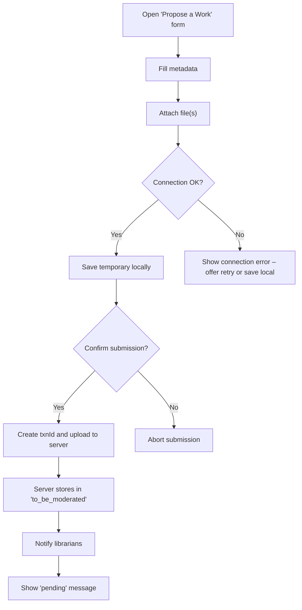

```mermaid
flowchart TD
    %% Activity Diagram: Submit a Digitized Work

    A["Open 'Propose a Work' form"] --> B["Fill metadata"]
    B --> C["Attach file(s)"]
    C --> D{"Connection OK?"}
    D -->|Yes| E["Save temporary locally"]
    E --> F{"Confirm submission?"}
    F -->|Yes| G["Create txnId and upload to server"]
    G --> H["Server stores in 'to_be_moderated'"]
    H --> I["Notify librarians"]
    I --> J["Show 'pending' message"]
    F -->|No| K["Abort submission"]
    D -->|No| L["Show connection error – offer retry or save local"]


```
