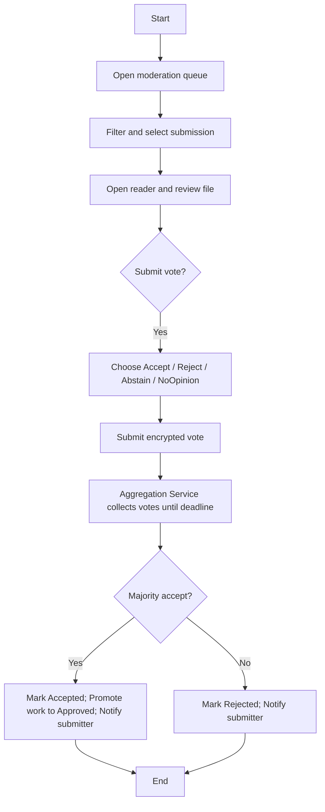

```mermaid
flowchart TD
    %% Activity Diagram: Moderate a Digitized Work (voting lifecycle)

    Start["Start"] --> A["Open moderation queue"]
    A --> B["Filter and select submission"]
    B --> C["Open reader and review file"]
    C --> D{"Submit vote?"}
    D -->|Yes| E["Choose Accept / Reject / Abstain / NoOpinion"]
    E --> F["Submit encrypted vote"]
    F --> G["Aggregation Service collects votes until deadline"]
    G --> H{"Majority accept?"}
    H -->|Yes| I["Mark Accepted; Promote work to Approved; Notify submitter"]
    H -->|No| J["Mark Rejected; Notify submitter"]
    I --> End["End"]
    J --> End
```    
