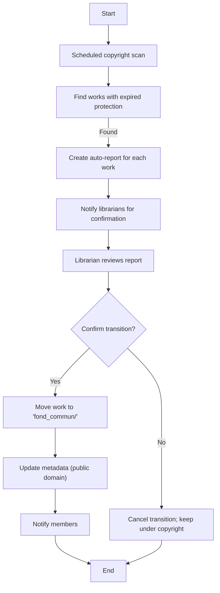

```mermaid
flowchart TD
    %% Activity Diagram: Passage of a Work into Public Domain

    Start["Start"] --> A["Scheduled copyright scan"]
    A --> B["Find works with expired protection"]
    B -->|Found| C["Create auto-report for each work"]
    C --> D["Notify librarians for confirmation"]
    D --> E["Librarian reviews report"]
    E --> F{"Confirm transition?"}
    F -->|Yes| G["Move work to 'fond_commun/'"]
    G --> H["Update metadata (public domain)"]
    H --> I["Notify members"]
    F -->|No| J["Cancel transition; keep under copyright"]
    I --> End["End"]
    J --> End
```