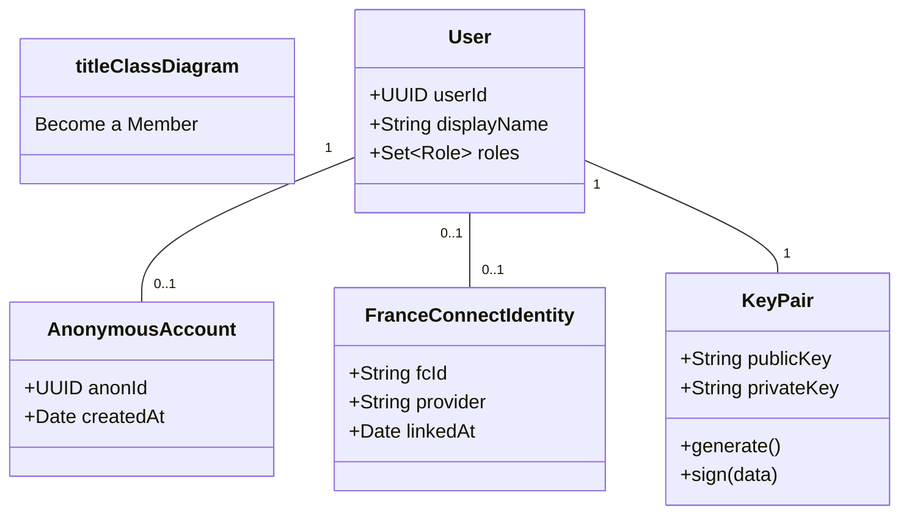

```mermaid
classDiagram
    title Class Diagram: Become a Member

    class User {
      +UUID userId
      +String displayName
      +Set~Role~ roles
    }
    class AnonymousAccount {
      +UUID anonId
      +Date createdAt
    }
    class FranceConnectIdentity {
      +String fcId
      +String provider
      +Date linkedAt
    }
    class KeyPair {
      +String publicKey
      +String privateKey
      +generate()
      +sign(data)
    }

    User "1" -- "0..1" AnonymousAccount
    User "0..1" -- "0..1" FranceConnectIdentity
    User "1" -- "1" KeyPair
```