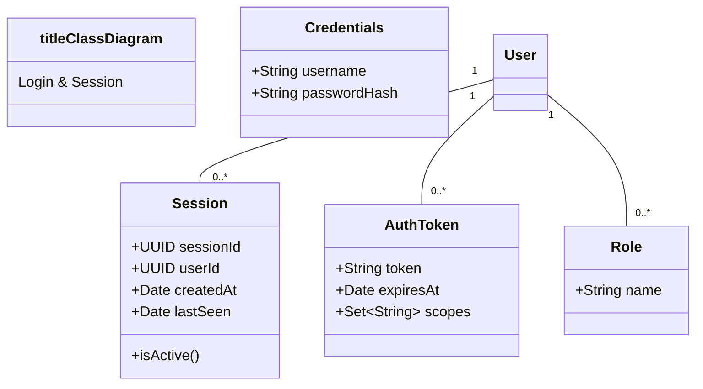

```mermaid
classDiagram
    title Class Diagram: Login & Session

    class Credentials {
      +String username
      +String passwordHash
    }
    class AuthToken {
      +String token
      +Date expiresAt
      +Set~String~ scopes
    }
    class Session {
      +UUID sessionId
      +UUID userId
      +Date createdAt
      +Date lastSeen
      +isActive()
    }
    class Role {
      +String name
    }

    User "1" -- "0..*" Session
    User "1" -- "0..*" AuthToken
    User "1" -- "0..*" Role
```