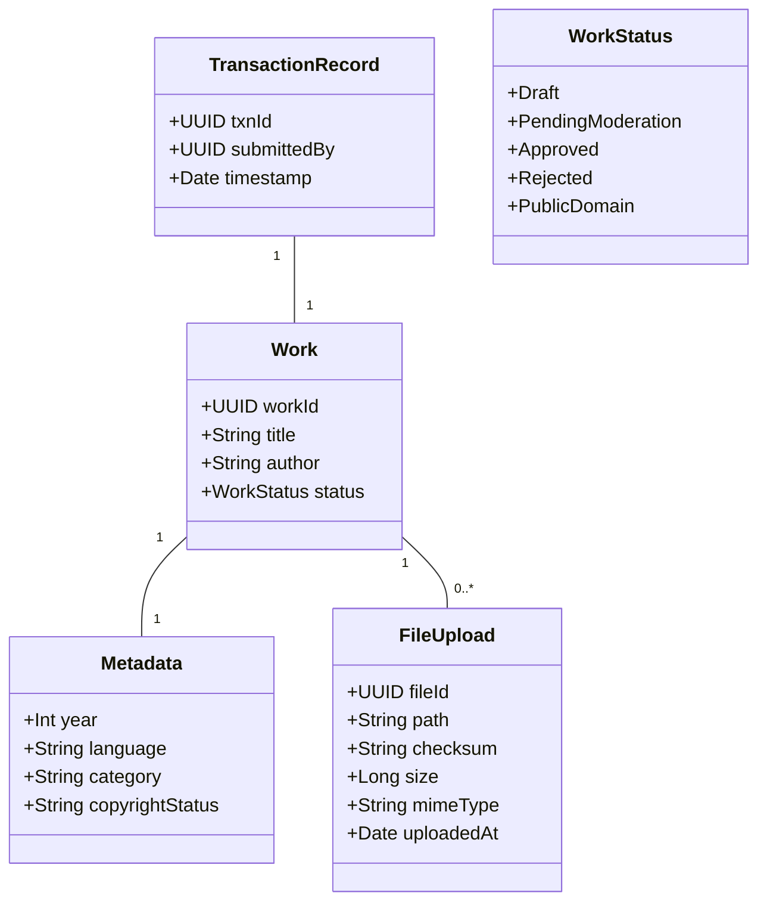

```mermaid
classDiagram
    %% Class Diagram: Submit a Digitized Work

    class Work {
      +UUID workId
      +String title
      +String author
      +WorkStatus status
    }
    class Metadata {
      +Int year
      +String language
      +String category
      +String copyrightStatus
    }
    class FileUpload {
      +UUID fileId
      +String path
      +String checksum
      +Long size
      +String mimeType
      +Date uploadedAt
    }
    class TransactionRecord {
      +UUID txnId
      +UUID submittedBy
      +Date timestamp
    }
    class WorkStatus {
      +Draft
      +PendingModeration
      +Approved
      +Rejected
      +PublicDomain
    }

    Work "1" -- "1" Metadata
    Work "1" -- "0..*" FileUpload
    TransactionRecord "1" -- "1" Work
```