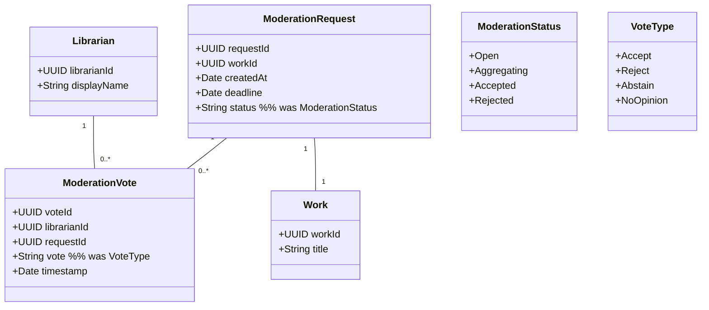

```mermaid
classDiagram
    %% Class Diagram: Moderate a Digitized Work

    class ModerationRequest {
      +UUID requestId
      +UUID workId
      +Date createdAt
      +Date deadline
      +String status   %% was ModerationStatus
    }
    class ModerationVote {
      +UUID voteId
      +UUID librarianId
      +UUID requestId
      +String vote     %% was VoteType
      +Date timestamp
    }
    class Librarian {
      +UUID librarianId
      +String displayName
    }

    %% Represent enums as simple classes (Mermaid-friendly)
    class ModerationStatus {
      +Open
      +Aggregating
      +Accepted
      +Rejected
    }
    class VoteType {
      +Accept
      +Reject
      +Abstain
      +NoOpinion
    }

    class Work {
      +UUID workId
      +String title
    }

    ModerationRequest "1" -- "0..*" ModerationVote
    Librarian "1" -- "0..*" ModerationVote
    ModerationRequest "1" -- "1" Work

```

