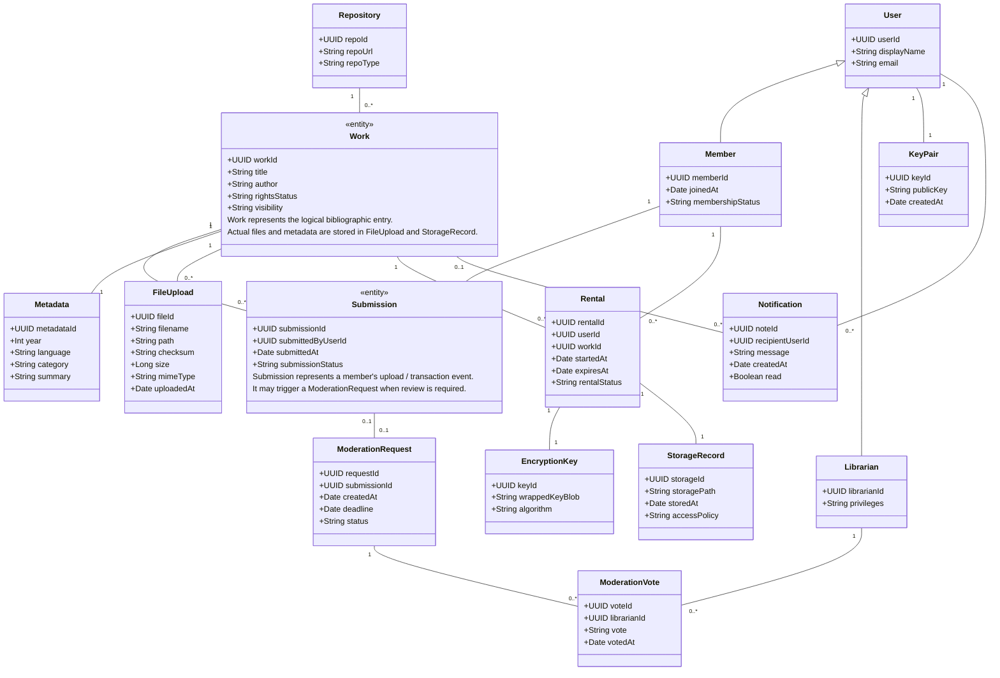

```mermaid

classDiagram
    %% Global Class Diagram (Final Fixed Version)

    %% ===== Domain Entities =====
    class User {
      +UUID userId
      +String displayName
      +String email
    }

    class Member {
      +UUID memberId
      +Date joinedAt
      +String membershipStatus
    }

    class Librarian {
      +UUID librarianId
      +String privileges
    }

    class KeyPair {
      +UUID keyId
      +String publicKey
      +Date createdAt
    }

    class Work {
      +UUID workId
      +String title
      +String author
      +String rightsStatus
      +String visibility
    }

    class Metadata {
      +UUID metadataId
      +Int year
      +String language
      +String category
      +String summary
    }

    class FileUpload {
      +UUID fileId
      +String filename
      +String path
      +String checksum
      +Long size
      +String mimeType
      +Date uploadedAt
    }

    class Submission {
      +UUID submissionId
      +UUID submittedByUserId
      +Date submittedAt
      +String submissionStatus
    }

    class ModerationRequest {
      +UUID requestId
      +UUID submissionId
      +Date createdAt
      +Date deadline
      +String status
    }

    class ModerationVote {
      +UUID voteId
      +UUID librarianId
      +String vote
      +Date votedAt
    }

    class Rental {
      +UUID rentalId
      +UUID userId
      +UUID workId
      +Date startedAt
      +Date expiresAt
      +String rentalStatus
    }

    class EncryptionKey {
      +UUID keyId
      +String wrappedKeyBlob
      +String algorithm
    }

    class StorageRecord {
      +UUID storageId
      +String storagePath
      +Date storedAt
      +String accessPolicy
    }

    class Repository {
      +UUID repoId
      +String repoUrl
      +String repoType
    }

    class Notification {
      +UUID noteId
      +UUID recipientUserId
      +String message
      +Date createdAt
      +Boolean read
    }

    %% ===== Inheritance (Users) =====
    User <|-- Member
    User <|-- Librarian

    %% ===== Associations & Cardinalities =====
    User "1" -- "1" KeyPair
    Member "1" -- "0..*" Submission
    Work "1" -- "0..*" Submission
    Work "1" -- "1" Metadata
    Work "1" -- "0..*" FileUpload
    Submission "0..1" -- "0..1" ModerationRequest
    ModerationRequest "1" -- "0..*" ModerationVote
    Librarian "1" -- "0..*" ModerationVote
    Member "1" -- "0..*" Rental
    Work "1" -- "0..*" Rental
    Rental "1" -- "1" EncryptionKey
    Rental "1" -- "1" StorageRecord
    Repository "1" -- "0..*" Work
    User "1" -- "0..*" Notification
    Work "0..1" -- "0..*" Notification

    %% ===== Notes (Fixed Syntax) =====
    class Work {
        <<entity>>
        Work represents the logical bibliographic entry.
        Actual files and metadata are stored in FileUpload and StorageRecord.
    }

    class Submission {
        <<entity>>
        Submission represents a member's upload / transaction event.
        It may trigger a ModerationRequest when review is required.
    }

```