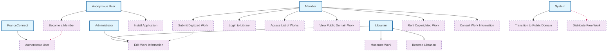

```mermaid
graph TD
    %% Actors
    AU[Anonymous User]
    M[Member]
    L[Librarian]
    A[Administrator]
    FC[FranceConnect]
    S[System]
    
    %% Use Cases
    UC1[Install Application]
    UC2[Become a Member]
    UC3[Login to Library]
    UC4[Access List of Works]
    UC5[View Public Domain Work]
    UC6[Submit Digitized Work]
    UC7[Rent Copyrighted Work]
    UC8[Consult Work Information]
    UC9[Moderate Work]
    UC10[Edit Work Information]
    UC11[Become Librarian]
    UC12[Authenticate User]
    UC13[Transition to Public Domain]
    UC14[Distribute Free Work]
    
    %% Relationships
    AU --> UC1
    AU --> UC2
    M --> UC3
    M --> UC4
    M --> UC5
    M --> UC6
    M --> UC7
    M --> UC8
    L --> UC9
    L --> UC10
    L --> UC11
    A --> UC10
    FC --> UC12
    S --> UC13
    S --> UC14
    
    %% Include relationships (dotted lines)
    UC2 -.-> UC12
    UC6 -.-> UC10
    
    %% Styling
    classDef actor fill:#e1f5fe,stroke:#01579b,stroke-width:2px
    classDef useCase fill:#f3e5f5,stroke:#4a148c,stroke-width:1px,stroke-dasharray: 5 5
    classDef include fill:#fff,stroke:#c2185b,stroke-dasharray: 5 5
    
    class AU,M,L,A,FC,S actor
    class UC1,UC2,UC3,UC4,UC5,UC6,UC7,UC8,UC9,UC10,UC11,UC12,UC13,UC14 useCase
    linkStyle 14,15 stroke:#c2185b,stroke-dasharray: 5,5;
```