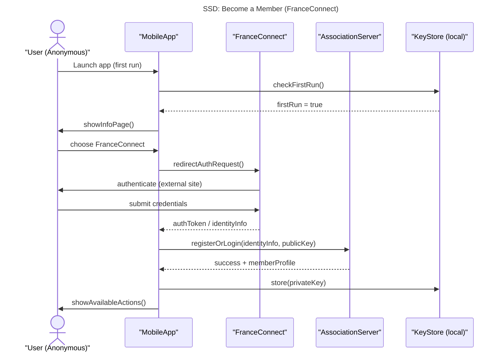

```mermaid
sequenceDiagram
    title SSD: Become a Member (FranceConnect)
    actor User as "User (Anonymous)"
    participant App as "MobileApp"
    participant FC as "FranceConnect"
    participant Server as "AssociationServer"
    participant KeyStore as "KeyStore (local)"

    User->>App: Launch app (first run)
    App->>KeyStore: checkFirstRun()
    KeyStore-->>App: firstRun = true
    App->>User: showInfoPage()
    User->>App: choose FranceConnect
    App->>FC: redirectAuthRequest()
    FC->>User: authenticate (external site)
    User->>FC: submit credentials
    FC-->>App: authToken / identityInfo
    App->>Server: registerOrLogin(identityInfo, publicKey)
    Server-->>App: success + memberProfile
    App->>KeyStore: store(privateKey)
    App->>User: showAvailableActions()

```