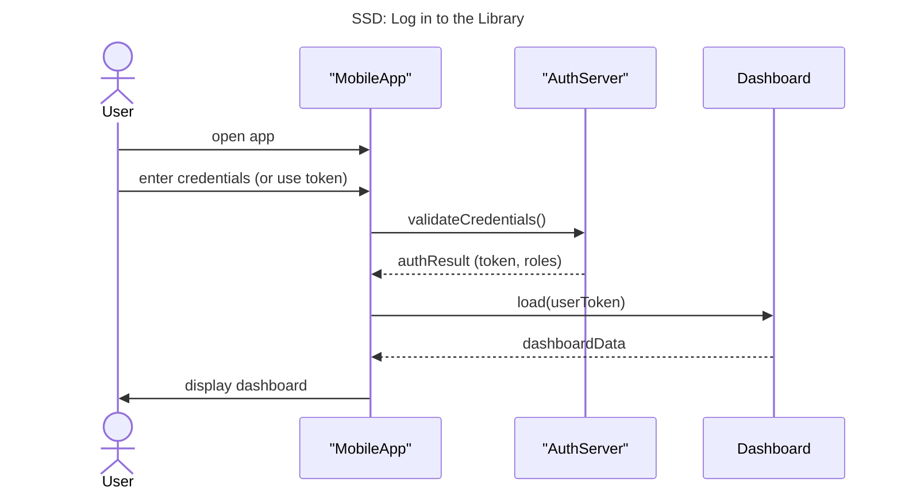

```mermaid
sequenceDiagram
    title SSD: Log in to the Library
    actor User
    participant App as "MobileApp"
    participant Auth as "AuthServer"
    participant Dashboard

    User->>App: open app
    User->>App: enter credentials (or use token)
    App->>Auth: validateCredentials()
    Auth-->>App: authResult (token, roles)
    App->>Dashboard: load(userToken)
    Dashboard-->>App: dashboardData
    App->>User: display dashboard

```
