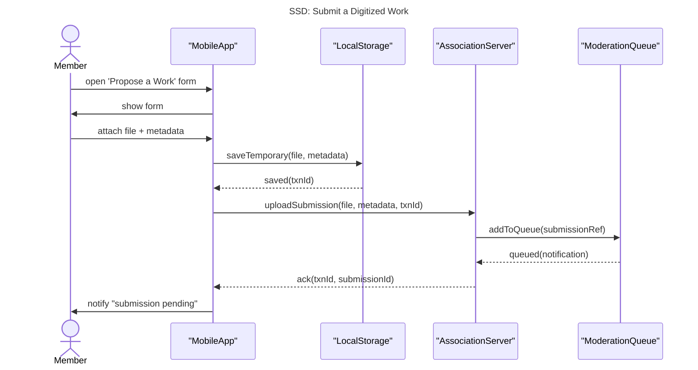

```mermaid
sequenceDiagram
    title SSD: Submit a Digitized Work
    actor Member
    participant App as "MobileApp"
    participant Local as "LocalStorage"
    participant Server as "AssociationServer"
    participant MQ as "ModerationQueue"

    Member->>App: open 'Propose a Work' form
    App->>Member: show form
    Member->>App: attach file + metadata
    App->>Local: saveTemporary(file, metadata)
    Local-->>App: saved(txnId)
    App->>Server: uploadSubmission(file, metadata, txnId)
    Server->>MQ: addToQueue(submissionRef)
    MQ-->>Server: queued(notification)
    Server-->>App: ack(txnId, submissionId)
    App->>Member: notify "submission pending"

```
