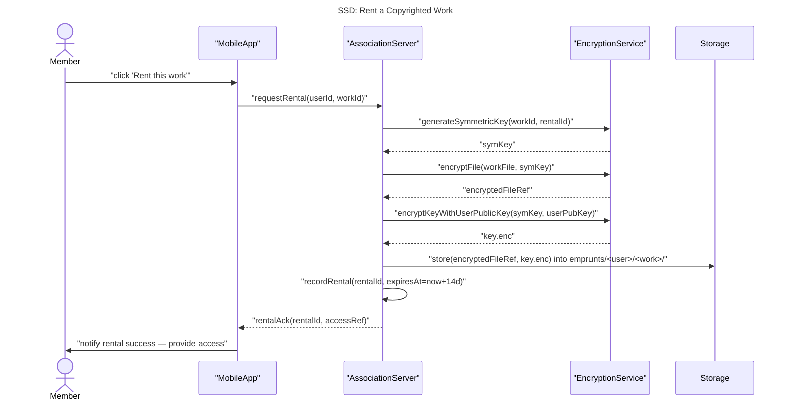

```mermaid
sequenceDiagram
    title SSD: Rent a Copyrighted Work
    actor M as Member
    participant App as "MobileApp"
    participant Server as "AssociationServer"
    participant Enc as "EncryptionService"
    participant Storage

    M->>App: "click 'Rent this work'"
    App->>Server: "requestRental(userId, workId)"
    Server->>Enc: "generateSymmetricKey(workId, rentalId)"
    Enc-->>Server: "symKey"
    Server->>Enc: "encryptFile(workFile, symKey)"
    Enc-->>Server: "encryptedFileRef"
    Server->>Enc: "encryptKeyWithUserPublicKey(symKey, userPubKey)"
    Enc-->>Server: "key.enc"
    Server->>Storage: "store(encryptedFileRef, key.enc) into emprunts/<user>/<work>/"
    Server->>Server: "recordRental(rentalId, expiresAt=now+14d)"
    Server-->>App: "rentalAck(rentalId, accessRef)"
    App->>M: "notify rental success — provide access"


```
